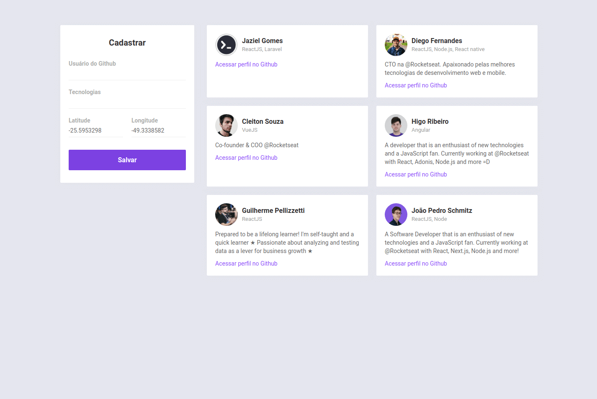
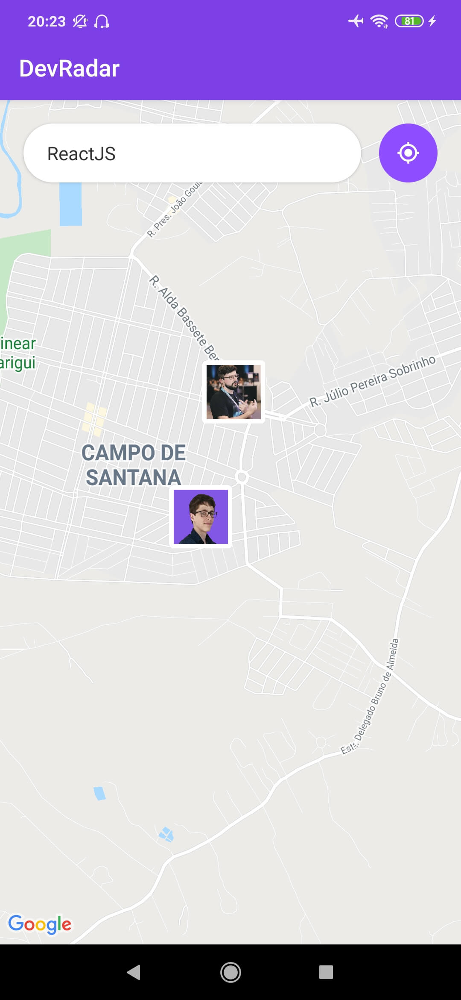
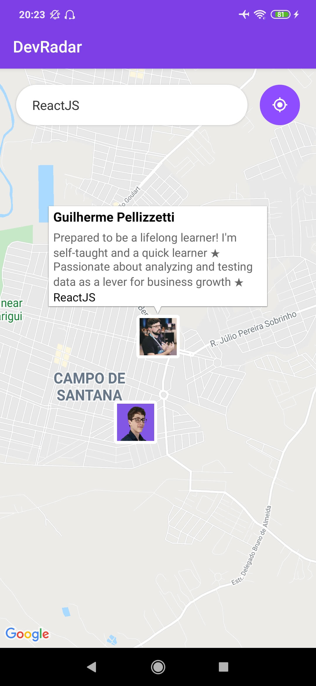
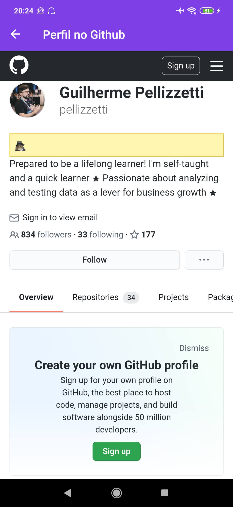

# Rocketseat Omnistack 10

<h1 align="center">
    
</h1>

<h1 align="center">
    
    
    
</h1>

## 💻 Projeto

Projeto desenvolvido no evento "Omnistack 10" da [Rocketseat](https://rocketseat.com.br/).

O DevRadar é um projeto que visa conectar desenvolvedores próximos a você que trabalham com as mesmas tecnologias.

## :rocket: Tecnologias

Esse projeto foi desenvolvido com as seguintes tecnologias:

- [Node.js](https://nodejs.org/en/)
- [React](https://pt-br.reactjs.org/)
- [React Native](https://reactnative.dev/)
- [Expo](https://expo.io/)
- [MongoDB](https://www.mongodb.com)

## :information_source: Como usar

Para clonar essa aplicação, você vai precisar de [Git](https://git-scm.com/), Node.js v10 e [yarn](https://yarnpkg.com) instalado.

### Rodar API

Configurar a conexão do banco de dados mongodb em `backend/src/index.js`.

```bash
# Diretório da API
cd backend/

# Instalar dependências
yarn install

# Iniciar servidor rodando na porta 3333
yarn dev
```

### Rodar Frontend

Configurar a conexão com o backend em `web/src/services/api.js`

```bash
# Diretório do frontend
cd web

# Instalar dependências
yarn install

# Iniciar aplicação rodando na porta 3000
yarn start
```

### Rodar Mobile

Configurar a conexão com o backend em `mobile/src/services/api.js` e `mobile/src/services/socket.js`.

```bash
# Diretório do mobile
cd mobile

# Instalar dependências
yarn install

# Iniciar aplicação no Expo
yarn start
```

## :memo: Licença

Esse projeto está sob a licença MIT. Veja o arquivo [LICENSE](LICENSE.md) para mais detalhes.

---

<sup>Projeto desenvolvido com a tutoria de [Diego Fernandes](https://github.com/diego3g), da [Rocketseat](https://rocketseat.com.br/).</sup>
